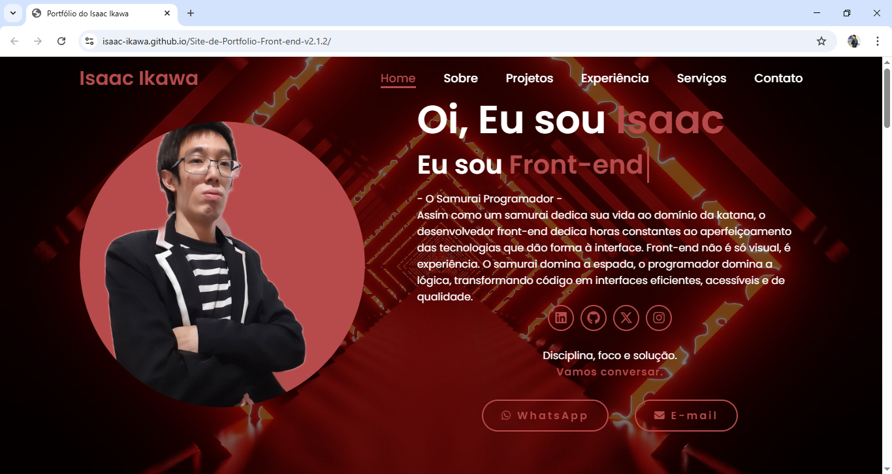

# Portfólio | Isaac Ikawa

## 🧩 Descrição
Portfólio pessoal desenvolvido para apresentar meus projetos, habilidades e evolução como desenvolvedor front-end.

## 🎯 Objetivo
Demonstrar conhecimentos em desenvolvimento front-end utilizando HTML, CSS, JavaScript e outras tecnologias, com foco em responsividade, organização e experiência do usuário.

## 🛠️ Tecnologias Utilizadas
- HTML5 (estrutura semântica)
- CSS3 (Flexbox, Grid, animações e responsividade)
- JavaScript (DOM, eventos e interações)
- Font Awesome
- Google Fonts (Poppins)
- Formspree (formulário de contato)
- Git & GitHub

## ⚙️ Funcionalidades
- Layout responsivo
- Menu dinâmico conforme rolagem da página
- Header inteligente (scroll up/down)
- Efeito de digitação animada
- Partículas interativas seguindo o mouse
- Vídeo de fundo com camada de contraste
- Cards interativos para projetos
- Links diretos para redes sociais e contato
- Página de contato funcional com envio de mensagens

## 📂 Estrutura do Projeto
- **HTML:** Estrutura semântica das páginas
- **CSS:** Estilização visual, responsividade e animações
- **JavaScript:** Interações, efeitos visuais e controle de navegação
- **Contato:** Formulário integrado ao Formspree

## 📱 Responsividade
O site se adapta a diferentes tamanhos de tela (desktop, tablet e mobile), garantindo boa usabilidade em qualquer dispositivo.

## 🚀 Acesso ao Projeto
🔗 **Deploy:** https://isaac-ikawa.github.io/Site-de-Portfolio-Front-end-v2.1.6  
📁 **Repositório:** https://github.com/isaac-ikawa/Site-de-Portfolio-Front-end-v2.1.6

---
Desenvolvido por **Isaac Ikawa** 👨‍💻
